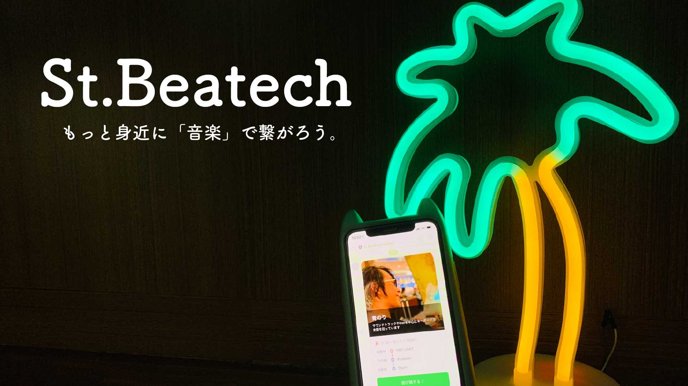

# St.Beatech (Street Beacon / Beat Tech)

## 製品概要
### Be × Tech
#### 『音楽をもっと多くの人に』

ストリートライブで、多くの人に参加してもらえる「きっかけ」を作るデバイス。
もっと身近に「音楽」で繋がろう。

### 背景（製品開発のきっかけ、課題等）
多くの人が通る大通りなどでは、ストリートライブを見かけることも少なくない。
しかし、演者としては、パフォーマンスをすることをメインとするため、ビラを配ったりすることができず、多くの人にアピールするタイミングを失ってしまうことも起こってしまう。
また、リスナーとしても、道中で急いでいたり、スマートフォンでSNSをしたりと、なかなかライブに参加しにくいこともある。

私たちは、そんな演者やリスナーに対して、ストリートライブの情報を伝えるプロダクトがあれば、もっと多くの人がストリートライブに参加するきっかけを作ることができるのではないかと考え、このプロダクトを作成した。

また、ストリートライブ特有の『投げ銭』を簡単かつ手軽にすることは、ライブに参加するハードルを下げる1つのツールである。今回は、「ストリートライブの情報を伝える」ことと、「投げ銭を簡単にする」の2面をLINEを利用した1つのプロダクトで完結させることとした。

なお、『Be × Tech』の"Be"には、今回のプロダクトで使用している≪Beacon≫と、音楽のリズムと言う意味で≪Beat≫の2つのワードの意味が込められている。

### 製品説明（具体的な製品の説明）
#### 演者（パフォーマー）の操作方法
- 事前にSpotifyでセットリストのプレイリストを作成しておきます
- 演者向けLINE BotにSpotifyのプレイリストのリンクを送信します
- あとはライブがスタートする時に「スタート」ボタンを押すだけ
- 曲が変わる時に「次の曲」ボタンを押すことで、リアルタイムにリスナーに曲名を伝えることができます
- ライブが終わったら「ストップボタン」を押す

#### リスナーの操作方法
- リスナー向けLINE Botを登録しておきます
- 演者の近くになるとLINEにフレックスメッセージが届きます
- あとはライブを楽しむだけ
- リアルタイムで曲名がわかったり、投げ銭をしたりできます
- 気に入った曲があったら、SNSで共有しよう

### 特長

#### 1. LINEで近くのストリートライブをお知らせ
LINE Beaconを持ち運びデバイスに搭載しているため、リスナーがストリートライブを開催している付近に近づくと、自動的にLINEにお知らせ。
演者の名前やSNSのアカウントなども同時に表示するため、気に入った時や忙しい時でも後から確認することが可能。

#### 2. アクションを起こしにくい「投げ銭」を簡単に
LINE Payを用いて、投げ銭が行えることを想定。
演者の前で投げ銭する時のタイミングや、現金を準備することを深く考えなくても、気軽に投げ銭することが可能に。

#### 3. 気に入った曲をすぐにチェック
リアルタイムで演者が演奏している楽曲が閲覧可能。
Spotifyのプレイリストと連携するので、すぐに聴くこともSNSで友達共有することもできる。

### 解決出来ること
これまでの路上ライブでは、演者とのコミュニケーションや投げ銭などの行為は比較的ハードルの高いものであった。
St.Beatechでは、創作活動についてや楽曲、ライブ状況などの情報を演者側から提供できるため、興味を持つまでのハードルを低くすることができる。演者は多くの通行人に知ってもらえる機会が増え、今まで路上ライブへのハードルを感じていた人や、投げ銭をしたことない人も
もっと身近に「音楽」で繋がることができるだろう。

### 今後の展望
投げ銭の処理はモックとして扱っているが、今後の展望として実際の決済処理を取り入れることを視野に入れていきたい。
またLINEのAPIの仕様により、push通知が困難となっている。それに伴い、リアルタイムで演者に投げ銭通知を送ることができない。
これはチームとしてもっとも課題にしていることであり、早期解決をできるように議論を進めていきたい。

## 開発内容・開発技術
* 演者用デバイス
* AWSで制作したAPI
* LINE Messaging APIを用いたアプリケーション

### 活用した技術
* BLE(Bluetooth Low Energy)

#### API・データ
* LINE Messaging API
* AWS lambda
* AWS Gateway
* DynamoDB
* Spotify API

#### フレームワーク・ライブラリ・モジュール
* arduino-esp32
* ドンキホーテの沖縄っぽいLEDライト

#### デバイス
* 演者用デバイス
    * LINE Beacon
* スマートフォン

### 独自開発技術（Hack Dayで開発したもの）
#### 2日間に開発した独自の機能・技術
* LINE Beaconを取得し、そのBeaconに紐づけられた演者情報を表示するAPI
* 演者用に特化した、持ち運び可能なLINE Beaconを搭載した独自デバイス